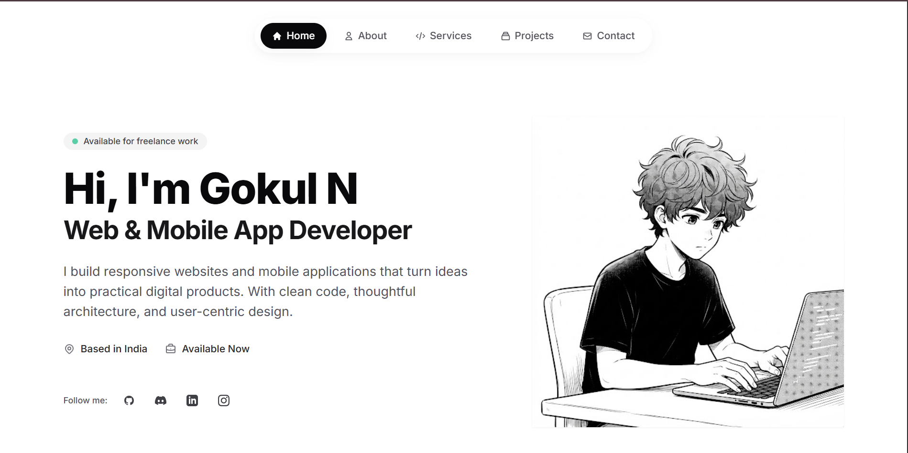

# Gokul N — Freelancer Portfolio Website

A modern, responsive portfolio website and backend inquiry service built with clean design, thoughtful architecture, and user-centric experience.

<p align="center">
  
</p>

---

## 🚀 Features

- **Modern & Minimal Design**: Sleek typography, subtle micro-animations, and clean layout built with Tailwind CSS.
- **Multi-Page Experience**:
  - **Home**: Hero section, services snapshot, featured works, and social links.
  - **About**: Developer background, tech stack, and experience.
  - **Services**: Service offerings, process breakdown, and FAQ accordions.
  - **Projects**: Filterable project gallery with live previews and tech tags.
  - **Contact**: Functional project inquiry brief form with copy-to-clipboard contact card.
- **TypeScript Backend**: Express.js server providing automated email notifications via Nodemailer on inquiry submissions.
- **Cloud Ready**: Configured for seamless deployment on Vercel with serverless functions and clean URLs.

---

## 🛠️ Tech Stack

- **Frontend**: HTML5, Vanilla JavaScript, Tailwind CSS, Google Fonts (Inter, JetBrains Mono)
- **Backend**: Node.js, Express.js, TypeScript
- **Email Service**: Nodemailer (SMTP integration)
- **Deployment**: Vercel

---

## 💻 Getting Started Locally

### 1. Clone the repository
```bash
git clone https://github.com/Gokul-CyberExpert/my-freelancer-website.git
cd my-freelancer-website
```

### 2. Install dependencies
```bash
npm install
```

### 3. Set up environment variables
Create a `.env` file in the root directory:
```env
PORT=5000
EMAIL_HOST=smtp.gmail.com
EMAIL_PORT=587
EMAIL_USER=your-email@gmail.com
EMAIL_PASS=your-app-password
EMAIL_TO=your-receiving-email@gmail.com
CORS_ORIGIN=http://localhost:5000
```

### 4. Run development server
```bash
npm run dev
```
Open `http://localhost:5000` in your browser.

---

## 📦 Build for Production

```bash
# Compile TypeScript to dist/
npm run build

# Start production server
npm start
```

---

## 📬 Contact & Connect

- **GitHub**: [@Gokul-CyberExpert](https://github.com/Gokul-CyberExpert)
- **Discord**: [User Profile](https://discord.com/users/1496848249871401002)
